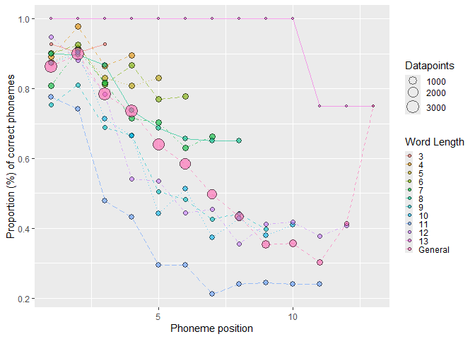

<!-- README.md is generated from README.Rmd. Please edit that file -->

# sunflower: Assessing and Categorizing Production Errors in Spanish

<!-- badges: start -->

[](https://www.gnu.org/licenses/gpl-3.0)


<!-- badges: end -->

The goal of *sunflower* is to handle multiple response data, compute
formal metrics, and classify production errors, whether in speech or
spelling transcriptions. The outputs of this package make it easy to run
statistical analyses in [R](https://www.r-project.org/).

## Installation

You can install the current version of *sunflower* from
[GitHub](https://github.com/) using the following code lines. Also, it
is recommended to install the [tidyverse
package](https://www.tidyverse.org/) to allow the work with pipes, and
the [word2vec CRAN
package](https://cran.r-project.org/web/packages/word2vec/readme/README.html)
for computations involving word2vec models required to classify errors
(as described in the last section of this markdown).

``` r
install.packages("devtools")
devtools::install_github("ismaelgutier/sunflower")
install.packages("tidyverse")
```

Once these packages have been installed, it is only required to load
then in R (recommended working with
[RStudio](https://posit.co/download/rstudio-desktop/) to have an optimal
IDE).

``` r
require("sunflower")
require("tidyverse")
```

## How to use

### Compute formal similarity metrics

``` r
df_to_formal_metrics = sunflower::IGC_long_phon %>% select(-c(modality, task_modality,task_type, test, task))


formal_metrics_computed = df_to_formal_metrics %>% get_formal_indexes(item_col = "item_phon",
                                             response_col = "response_phon",
                                             attempt_col = "Attempt",
                                             group_cols = c("ID", "item_ID"))
#> The function get_formal_indexes() took 1.22 seconds to be executed

formal_metrics_computed %>% head(8) %>% knitr::kable()
```

|  ID | item_ID | item  | item_phon |  RA | Attempt | response | response_phon | targetL | responseL | p_shared_char | p_shared_char_in_pos | diff_char_num |  Ld | DLd |       JWd | pcc | approach_diff | accessed | lcs   | similarity_str | strict_match_pos | itemL_adj_strict_match_pos |
|----:|--------:|:------|:----------|----:|--------:|:---------|:--------------|--------:|----------:|--------------:|---------------------:|--------------:|----:|----:|----------:|----:|--------------:|---------:|:------|:---------------|:-----------------|:---------------------------|
| 517 |       1 | vago  | baɡo      |   0 |       1 | vago     | baɡo          |       4 |         4 |     1.0000000 |                  1.0 |             0 |   0 |   0 | 0.0000000 | 1.0 |            NA |        1 | baɡo  | MMMM           | 1111             | 1111                       |
| 518 |       2 | bario | baɾjo     |   0 |       1 | bario    | baɾjo         |       5 |         5 |     1.0000000 |                  1.0 |             0 |   0 |   0 | 0.0000000 | 1.0 |            NA |        1 | baɾjo | MMMMM          | 11111            | 11111                      |
| 519 |       3 | tenia | tenja     |   0 |       1 | tenia    | tenja         |       5 |         5 |     1.0000000 |                  1.0 |             0 |   0 |   0 | 0.0000000 | 1.0 |            NA |        1 | tenja | MMMMM          | 11111            | 11111                      |
| 520 |       4 | medio | medjo     |   0 |       1 | medio    | medjo         |       5 |         5 |     1.0000000 |                  1.0 |             0 |   0 |   0 | 0.0000000 | 1.0 |            NA |        1 | medjo | MMMMM          | 11111            | 11111                      |
| 521 |       5 | patio | patjo     |   0 |       1 | patio    | patjo         |       5 |         5 |     1.0000000 |                  1.0 |             0 |   0 |   0 | 0.0000000 | 1.0 |            NA |        1 | patjo | MMMMM          | 11111            | 11111                      |
| 522 |       6 | veloz | beloθ     |   1 |       1 | ver      | beɾ           |       5 |         3 |     0.5000000 |                  0.4 |             4 |   3 |   3 | 0.2488889 | 0.4 |            NA |        0 | be    | MMSDD          | 11000            | 11000                      |
| 522 |       6 | veloz | beloθ     |   1 |       2 | lo       | lo            |       5 |         2 |     0.5714286 |                  0.0 |             3 |   3 |   3 | 1.0000000 | 0.4 |           0.0 |        0 | lo    | DDMMD          | 00000            | 00000                      |
| 522 |       6 | veloz | beloθ     |   1 |       3 | feloz    | feloθ         |       5 |         5 |     0.8000000 |                  0.8 |             2 |   1 |   1 | 0.1333333 | 0.8 |           0.4 |        0 | eloθ  | SMMMM          | 01111            | 01111                      |

`Note`: Move the dataframe to the right to see all the columns and
metrics.

### Positional accuracy

``` r
positions_accuracy = formal_metrics_computed %>% 
  position_scores(match_col = "itemL_adj_strict_match_pos", last_ID_col = "targetL")

positions_accuracy %>% head(8) %>% knitr::kable()
```

|  ID | item_ID | item  | item_phon |  RA | Attempt | response | response_phon | targetL | Position | correct_pos |
|----:|--------:|:------|:----------|----:|--------:|:---------|:--------------|--------:|:---------|:------------|
| 517 |       1 | vago  | baɡo      |   0 |       1 | vago     | baɡo          |       4 | 1        | 1           |
| 517 |       1 | vago  | baɡo      |   0 |       1 | vago     | baɡo          |       4 | 2        | 1           |
| 517 |       1 | vago  | baɡo      |   0 |       1 | vago     | baɡo          |       4 | 3        | 1           |
| 517 |       1 | vago  | baɡo      |   0 |       1 | vago     | baɡo          |       4 | 4        | 1           |
| 518 |       2 | bario | baɾjo     |   0 |       1 | bario    | baɾjo         |       5 | 1        | 1           |
| 518 |       2 | bario | baɾjo     |   0 |       1 | bario    | baɾjo         |       5 | 2        | 1           |
| 518 |       2 | bario | baɾjo     |   0 |       1 | bario    | baɾjo         |       5 | 3        | 1           |
| 518 |       2 | bario | baɾjo     |   0 |       1 | bario    | baɾjo         |       5 | 4        | 1           |

`Note`: A plot depicting the positions’ accuracy of 14,418 datapoints.



### Classify productions

``` r
errors_classified = df_to_classify %>% 
  get_formal_similarity(target_col = "item", response_col = "Response", 
                            item_type = "task_type", source1 = wordlist) %>%
  get_semantic_similarity(target_col = "item", response_col = "Response", model = m_w2v) %>%
  classify_errors(access_col = "accessed", RA_col = "RA", response_col = "Response", classify_RAs = T)
#> The function get_formal_similarity() took 3.98 seconds to be executed
#> The function get_semantic_similarity() took 4.64 seconds to be executed

errors_classified %>% head(8) %>% knitr::kable()
```

|  ID | item_ID | item  |  RA | Attempt | Response | targetL | responseL | p_shared_char | p_shared_char_in_pos | diff_char_num |  Ld | DLd |       JWd | pcc | approach_diff | correct | lcs   | similarity_str | strict_match_pos | itemL_adj_strict_match_pos | shared_proportion | shared1char | is_plural | is_target_nonword | same_root | is_response_word | cosine_similarity | lexicalization | nonword | neologism | formal | unrelated | mixed | semantic | no_response | human_check |
|----:|--------:|:------|----:|--------:|:---------|--------:|----------:|--------------:|---------------------:|--------------:|----:|----:|----------:|----:|--------------:|--------:|:------|:---------------|:-----------------|:---------------------------|------------------:|------------:|----------:|------------------:|----------:|-----------------:|------------------:|---------------:|--------:|----------:|-------:|----------:|------:|---------:|------------:|:------------|
| 517 |       1 | vago  |   0 |       1 | vago     |       4 |         4 |     1.0000000 |                  1.0 |             0 |   0 |   0 | 0.0000000 | 1.0 |            NA |       1 | vago  | MMMM           | 1111             | 1111                       |         1.0000000 |           1 |         0 |                 0 |         1 |                1 |         1.0000000 |              0 |       0 |         0 |      0 |         0 |     0 |        0 |           0 |             |
| 518 |       2 | bario |   0 |       1 | bario    |       5 |         5 |     1.0000000 |                  1.0 |             0 |   0 |   0 | 0.0000000 | 1.0 |            NA |       1 | bario | MMMMM          | 11111            | 11111                      |         1.0000000 |           1 |         0 |                 0 |         1 |                1 |         1.0000000 |              0 |       0 |         0 |      0 |         0 |     0 |        0 |           0 |             |
| 519 |       3 | tenia |   0 |       1 | tenia    |       5 |         5 |     1.0000000 |                  1.0 |             0 |   0 |   0 | 0.0000000 | 1.0 |            NA |       1 | tenia | MMMMM          | 11111            | 11111                      |         1.0000000 |           1 |         0 |                 0 |         1 |                1 |         1.0000000 |              0 |       0 |         0 |      0 |         0 |     0 |        0 |           0 |             |
| 520 |       4 | medio |   0 |       1 | medio    |       5 |         5 |     1.0000000 |                  1.0 |             0 |   0 |   0 | 0.0000000 | 1.0 |            NA |       1 | medio | MMMMM          | 11111            | 11111                      |         1.0000000 |           1 |         0 |                 0 |         1 |                1 |         1.0000000 |              0 |       0 |         0 |      0 |         0 |     0 |        0 |           0 |             |
| 521 |       5 | patio |   0 |       1 | patio    |       5 |         5 |     1.0000000 |                  1.0 |             0 |   0 |   0 | 0.0000000 | 1.0 |            NA |       1 | patio | MMMMM          | 11111            | 11111                      |         1.0000000 |           1 |         0 |                 0 |         1 |                1 |         1.0000000 |              0 |       0 |         0 |      0 |         0 |     0 |        0 |           0 |             |
| 522 |       6 | veloz |   1 |       1 | ver      |       5 |         3 |     0.5000000 |                  0.4 |             4 |   3 |   3 | 0.2488889 | 0.4 |            NA |       0 | ve    | MMSDD          | 11000            | 11000                      |         0.5000000 |           1 |         0 |                 0 |         0 |                1 |         0.2804400 |              0 |       0 |         0 |      0 |         1 |     0 |        0 |           0 |             |
| 522 |       6 | veloz |   1 |       2 | lo       |       5 |         2 |     0.5714286 |                  0.0 |             3 |   3 |   3 | 1.0000000 | 0.4 |           0.0 |       0 | lo    | DDMMD          | 00000            | 00000                      |         0.5714286 |           0 |         0 |                 0 |         0 |                1 |         0.3502317 |              0 |       0 |         0 |      0 |         1 |     0 |        0 |           0 |             |
| 522 |       6 | veloz |   1 |       3 | feloz    |       5 |         5 |     0.8000000 |                  0.8 |             2 |   1 |   1 | 0.1333333 | 0.8 |           0.4 |       0 | eloz  | SMMMM          | 01111            | 01111                      |         0.8000000 |           0 |         0 |                 0 |         0 |                0 |                NA |              0 |       1 |         0 |      0 |        NA |     0 |        0 |           0 |             |

`Note 1`: Move the dataframe to the right to see all the columns and
errors.

`Note 2`: The `source1 = wordlist` is a txt file contained in the
dependency-bundle zip that can be found at our supplementary [OSF
repository](https://osf.io/akuxv/). The `model = m_w2v` is a word2vec
binary file located also in that zip (see the markdown in the vignettes
for further info).

`Note 3`: The quality of the classification performed directly depends
on the quality of the source files. Some words might not be available in
the `wordlist`, which comes from a prestigious Spanish dictionary (RAE).
We cannot solve this issue except by using double-checking and human
supervision.

------------------------------------------------------------------------

Any suggestions, comments, or questions about the functionality of the
package are warmly welcomed. If you are interested in contributing to
the project, such as by expanding it to other languages, please feel
free to contact us.

Thank you 🌻
