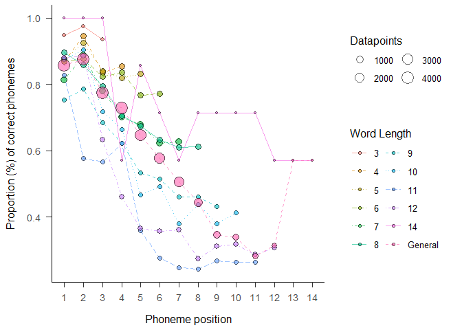

<!-- README.md is generated from README.Rmd. Please edit that file -->

# sunflower: A Package to Assess and Categorize Language Production Errors

<!-- badges start -->


[](https://www.gnu.org/licenses/gpl-3.0)


<!-- badges end -->
<div align="justify">

*sunflower* is a package designed to assist clinicians and researchers
in the fields of Speech Therapy and Neuropsychology of Language. Its
primary goal is to facilitate the management of multiple response data
and compute formal similarity indices to assess the quality of oral and
written productions in patients with aphasia and related disorders, such
as apraxia of speech, in Spanish. Additionally, the package allows for
the classification of these productions according to classical
typologies in the field, prior to computing formal and semantic
similarity measures. For the computation of the latter, *sunflower*
partially relies on natural language processing models such as word2vec.
The outputs provided by this package facilitate statistical analyses in
R, a widely-used tool in the field for data wrangling, visualization,
and analysis.

## Installation

*sunflower* can be installed as an R package with:

``` r
install.packages("devtools")
devtools::install_github("ismaelgutier/sunflower")
```

Once they are installed, we only need to load the *sunflower* package.
The *sunflower* package works using the pipe operator (`%>%`) from the
[*tidyverse* package](https://www.tidyverse.org/), allowing it to work
seamlessly with functions from other packages in the *tidyverse*, such
as *dplyr* for data wrangling, *readr* for data reading, and *ggplot2*
for data visualization. This can significantly enhance our workflow.

``` r
install.packages("tidyverse")
```

## How to use

### Loading the packages

Once installed, we only need to load the *sunflower* package. However,
as previously mentioned, the *tidyverse* package can also be valuable
for other complementary tasks.

``` r
require("sunflower")
require("tidyverse")
```

### Compute Formal Quality Indexes

``` r
df_to_formal_metrics = sunflower::IGC_long_phon %>% 
  dplyr::select(-c(modality, task_modality,task_type, test, task)) # keep some relevant columns


formal_metrics_computed = df_to_formal_metrics %>% 
    get_formal_similarity(item_col = "item", 
                          response_col = "response",
                          attempt_col = "Attempt",
                          group_cols = c("ID", "item_ID"))
#> The function get_formal_similarity() took 1.65 seconds to be executed

formal_metrics_computed %>% head(8) %>% knitr::kable()
```

|  ID | item_ID | item  | item_phon |  RA | Attempt | response | response_phon | targetL | responseL | p_shared_char | p_shared_char_in_pos | diff_char_num |  Ld | DLd |       JWd | pcc | approach_diff | accessed | lcs   | similarity_str | strict_match_pos | itemL_adj_strict_match_pos | shared1char | comment_warning |
|----:|--------:|:------|:----------|----:|--------:|:---------|:--------------|--------:|----------:|--------------:|---------------------:|--------------:|----:|----:|----------:|----:|--------------:|---------:|:------|:---------------|:-----------------|:---------------------------|:------------|:----------------|
| 517 |       1 | vago  | baɡo      |   0 |       1 | vago     | baɡo          |       4 |         4 |     1.0000000 |                  1.0 |             0 |   0 |   0 | 0.0000000 | 1.0 |            NA |        1 | vago  | MMMM           | 1111             | 1111                       | TRUE        |                 |
| 518 |       2 | bario | baɾjo     |   0 |       1 | bario    | baɾjo         |       5 |         5 |     1.0000000 |                  1.0 |             0 |   0 |   0 | 0.0000000 | 1.0 |            NA |        1 | bario | MMMMM          | 11111            | 11111                      | TRUE        |                 |
| 519 |       3 | tenia | tenja     |   0 |       1 | tenia    | tenja         |       5 |         5 |     1.0000000 |                  1.0 |             0 |   0 |   0 | 0.0000000 | 1.0 |            NA |        1 | tenia | MMMMM          | 11111            | 11111                      | TRUE        |                 |
| 520 |       4 | medio | medjo     |   0 |       1 | medio    | medjo         |       5 |         5 |     1.0000000 |                  1.0 |             0 |   0 |   0 | 0.0000000 | 1.0 |            NA |        1 | medio | MMMMM          | 11111            | 11111                      | TRUE        |                 |
| 521 |       5 | patio | patjo     |   0 |       1 | patio    | patjo         |       5 |         5 |     1.0000000 |                  1.0 |             0 |   0 |   0 | 0.0000000 | 1.0 |            NA |        1 | patio | MMMMM          | 11111            | 11111                      | TRUE        |                 |
| 522 |       6 | veloz | beloθ     |   1 |       1 | ver      | beɾ           |       5 |         3 |     0.5000000 |                  0.4 |             4 |   3 |   3 | 0.2488889 | 0.4 |            NA |        0 | ve    | MMSDD          | 11000            | 11000                      | TRUE        |                 |
| 522 |       6 | veloz | beloθ     |   1 |       2 | lo       | lo            |       5 |         2 |     0.5714286 |                  0.0 |             3 |   3 |   3 | 1.0000000 | 0.4 |           0.0 |        0 | lo    | DDMMD          | 00000            | 00000                      | FALSE       |                 |
| 522 |       6 | veloz | beloθ     |   1 |       3 | feloz    | feloθ         |       5 |         5 |     0.8000000 |                  0.8 |             2 |   1 |   1 | 0.1333333 | 0.8 |           0.4 |        0 | eloz  | SMMMM          | 01111            | 01111                      | FALSE       |                 |

`Note`: Move the dataframe to the right to see all the columns and
metrics.

### Obtain Positional Accuracy Data

``` r
positions_accuracy = formal_metrics_computed %>% 
  positional_accuracy(match_col = "itemL_adj_strict_match_pos", last_ID_col = "targetL")

positions_accuracy %>% head(8) %>% knitr::kable()
```

|  ID | item_ID | item  | item_phon |  RA | Attempt | response | response_phon | targetL | Position | correct_pos |
|----:|--------:|:------|:----------|----:|--------:|:---------|:--------------|--------:|:---------|:------------|
| 517 |       1 | vago  | baɡo      |   0 |       1 | vago     | baɡo          |       4 | 1        | 1           |
| 517 |       1 | vago  | baɡo      |   0 |       1 | vago     | baɡo          |       4 | 2        | 1           |
| 517 |       1 | vago  | baɡo      |   0 |       1 | vago     | baɡo          |       4 | 3        | 1           |
| 517 |       1 | vago  | baɡo      |   0 |       1 | vago     | baɡo          |       4 | 4        | 1           |
| 518 |       2 | bario | baɾjo     |   0 |       1 | bario    | baɾjo         |       5 | 1        | 1           |
| 518 |       2 | bario | baɾjo     |   0 |       1 | bario    | baɾjo         |       5 | 2        | 1           |
| 518 |       2 | bario | baɾjo     |   0 |       1 | bario    | baɾjo         |       5 | 3        | 1           |
| 518 |       2 | bario | baɾjo     |   0 |       1 | bario    | baɾjo         |       5 | 4        | 1           |

***Note.*** A plot depicting the positions’ accuracy of 14,418
datapoints.



### Classify Errors

``` r
errors_classified = df_to_classify %>% 
  check_lexicality(item_col = "item", response_col = "Response", criterion = "database") %>%
  get_formal_similarity(item_col = "item", response_col = "Response", 
                        attempt_col = "Attempt", group_cols = c("ID", "item_ID")) %>%
  get_semantic_similarity(item_col = "item", response_col = "Response", model = m_w2v) %>%
  classify_errors(response_col = "Response", item_col = "item",
                  access_col = "accessed", RA_col = "RA", also_classify_RAs = T)
#> The function check_lexicality() took 2.11 seconds to be executed
#> The function get_formal_similarity() took 2.78 seconds to be executed
#> The function get_semantic_similarity() took 3.19 seconds to be executed
#> The function classify_errors() took 3.22 seconds to be executed

errors_classified %>% head(8) %>% knitr::kable()
```

|  ID | item_ID | item  |  RA | Attempt | Response | targetL | responseL | p_shared_char | p_shared_char_in_pos | diff_char_num |  Ld | DLd |       JWd | pcc | approach_diff | correct | lcs   | similarity_str | strict_match_pos | itemL_adj_strict_match_pos | lexicality | shared1char | comment_warning | cosine_similarity | nonword | neologism | formal | unrelated | mixed | semantic | no_response | comment |
|----:|--------:|:------|----:|--------:|:---------|--------:|----------:|--------------:|---------------------:|--------------:|----:|----:|----------:|----:|--------------:|--------:|:------|:---------------|:-----------------|:---------------------------|-----------:|:------------|:----------------|------------------:|--------:|----------:|-------:|----------:|------:|---------:|------------:|:--------|
| 517 |       1 | vago  |   0 |       1 | vago     |       4 |         4 |     1.0000000 |                  1.0 |             0 |   0 |   0 | 0.0000000 | 1.0 |            NA |       1 | vago  | MMMM           | 1111             | 1111                       |          1 | TRUE        |                 |         1.0000000 |       0 |         0 |      0 |         0 |     0 |        0 |           0 |         |
| 518 |       2 | bario |   0 |       1 | bario    |       5 |         5 |     1.0000000 |                  1.0 |             0 |   0 |   0 | 0.0000000 | 1.0 |            NA |       1 | bario | MMMMM          | 11111            | 11111                      |          1 | TRUE        |                 |         1.0000000 |       0 |         0 |      0 |         0 |     0 |        0 |           0 |         |
| 519 |       3 | tenia |   0 |       1 | tenia    |       5 |         5 |     1.0000000 |                  1.0 |             0 |   0 |   0 | 0.0000000 | 1.0 |            NA |       1 | tenia | MMMMM          | 11111            | 11111                      |          1 | TRUE        |                 |         1.0000000 |       0 |         0 |      0 |         0 |     0 |        0 |           0 |         |
| 520 |       4 | medio |   0 |       1 | medio    |       5 |         5 |     1.0000000 |                  1.0 |             0 |   0 |   0 | 0.0000000 | 1.0 |            NA |       1 | medio | MMMMM          | 11111            | 11111                      |          1 | TRUE        |                 |         1.0000000 |       0 |         0 |      0 |         0 |     0 |        0 |           0 |         |
| 521 |       5 | patio |   0 |       1 | patio    |       5 |         5 |     1.0000000 |                  1.0 |             0 |   0 |   0 | 0.0000000 | 1.0 |            NA |       1 | patio | MMMMM          | 11111            | 11111                      |          1 | TRUE        |                 |         1.0000000 |       0 |         0 |      0 |         0 |     0 |        0 |           0 |         |
| 522 |       6 | veloz |   1 |       1 | ver      |       5 |         3 |     0.5000000 |                  0.4 |             4 |   3 |   3 | 0.2488889 | 0.4 |            NA |       0 | ve    | MMSDD          | 11000            | 11000                      |          1 | TRUE        |                 |         0.2804400 |       0 |         0 |      1 |         0 |     0 |        0 |           0 |         |
| 522 |       6 | veloz |   1 |       2 | lo       |       5 |         2 |     0.5714286 |                  0.0 |             3 |   3 |   3 | 1.0000000 | 0.4 |           0.0 |       0 | lo    | DDMMD          | 00000            | 00000                      |          0 | FALSE       |                 |         0.3502317 |       1 |         0 |      0 |         0 |     0 |        0 |           0 |         |
| 522 |       6 | veloz |   1 |       3 | feloz    |       5 |         5 |     0.8000000 |                  0.8 |             2 |   1 |   1 | 0.1333333 | 0.8 |           0.4 |       0 | eloz  | SMMMM          | 01111            | 01111                      |          0 | FALSE       |                 |                NA |       1 |         0 |      0 |         0 |     0 |        0 |           0 |         |

***Notes.*** Move the dataframe to the right to see all the columns and
errors.

*sunflower* allows for the classification of production errors once some
indexes related to responses to a stimulus have been obtained and
contextualized based on whether they come from repeated attempts or
single productions. This process involves three steps. First, a
lexicality check of the response is performed using the
`lexicality_check()` function, which involves determining whether the
response is a real word. To do this, the package searches for the
response in a database such as *BuscaPalabras*
([BPal](https://www.uv.es/~mperea/Davis_Perea_in_press.pdf)) and
compares its frequency with the target word to determine if it is a real
word based on whether it has a higher frequency or not when the
parameter `criterion = "database"` is set. Alternatively, the response
can be checked against a dictionary (*sunflower* searches for responses
among entries from the *Real Academia Española*,
[RAE](https://www.rae.es/)) when the parameter
`criterion = "dictionary"` is used.

Next, similarity measures between the targets and the responses are
obtained using various algorithms within the `get_formal_similarity()`
function. Finally, the cosine similarity between the two productions is
computed if possible using the `get_semantic_similarity()` function,
based on an NLP model. In our case, the parameter `model = m_w2v` refers
to a binary file containing a Spanish Billion Words embeddings corpus
created using the word2vec algorithm. This file is included in the zip
file (for more information, see the markdown in the vignettes) located
within the dependency-bundle zip, which can be found in our
supplementary [OSF repository mirror](https://osf.io/akuxv/).

------------------------------------------------------------------------

Thanks to Cristian Cardellino for making his work on the [Spanish
Billion Word Corpus and
Embeddings](https://crscardellino.github.io/SBWCE/) publicly available.

------------------------------------------------------------------------

Any suggestions, comments, or questions about the package’s
functionality are warmly welcomed. If you’d like to contribute to the
project, please feel free to get in touch. 🌻
