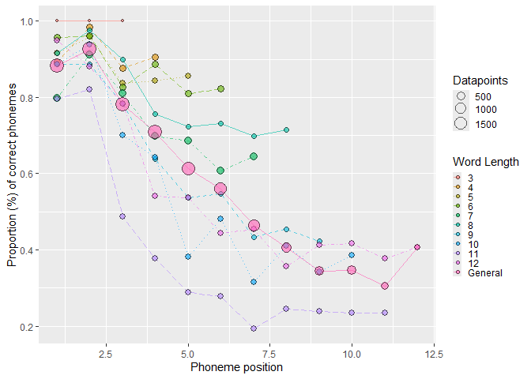

<!-- README.md is generated from README.Rmd. Please edit that file -->

# sunflower: Classifying Spanish production errors

<!-- badges: start -->
<!-- badges: end -->

The goal of *sunflower* is to handle multiple response data, compute
formal metrics, and classify production errors, whether in speech or
spelling transcriptions. The outputs of this package make it easy to run
statistical analyses in [R](https://www.r-project.org/).

## Installation

You can install the development version of sunflower from
[GitHub](https://github.com/) with: Also, make sure you install the
[tidyverse package](https://www.tidyverse.org/) to allow to work with
pipes.

``` r
# install.packages("devtools")
devtools::install_github("ismaelgutier/sunflower")
install.packages("tidyverse")
```

To use *sunflower*, the user will only need to load it in R, we
recommend to work with
[RStudio](https://posit.co/download/rstudio-desktop/).

``` r
require("sunflower")
require("tidyverse")
```

# How to use

``` r
require("sunflower")
#> Loading required package: sunflower
require("tidyverse")
#> Loading required package: tidyverse
#> Warning: package 'tidyverse' was built under R version 4.2.3
#> Warning: package 'ggplot2' was built under R version 4.2.3
#> Warning: package 'tibble' was built under R version 4.2.3
#> Warning: package 'tidyr' was built under R version 4.2.3
#> Warning: package 'readr' was built under R version 4.2.3
#> Warning: package 'purrr' was built under R version 4.2.3
#> Warning: package 'dplyr' was built under R version 4.2.3
#> Warning: package 'stringr' was built under R version 4.2.3
#> Warning: package 'forcats' was built under R version 4.2.3
#> Warning: package 'lubridate' was built under R version 4.2.3
#> ── Attaching core tidyverse packages ──────────────────────── tidyverse 2.0.0 ──
#> ✔ dplyr     1.1.4     ✔ readr     2.1.5
#> ✔ forcats   1.0.0     ✔ stringr   1.5.1
#> ✔ ggplot2   3.5.1     ✔ tibble    3.2.1
#> ✔ lubridate 1.9.3     ✔ tidyr     1.3.1
#> ✔ purrr     1.0.2
#> ── Conflicts ────────────────────────────────────────── tidyverse_conflicts() ──
#> ✖ dplyr::filter() masks stats::filter()
#> ✖ dplyr::lag()    masks stats::lag()
#> ℹ Use the conflicted package (<http://conflicted.r-lib.org/>) to force all conflicts to become errors
```

## Compute formal similarity metrics

``` r
df_to_formal_metrics = sunflower::IGC_long_phon %>% select(-c(modality, task_modality,task_type, test, task))


formal_metrics_computed = df_to_formal_metrics %>% get_formal_metrics(item_col = "item_phon",
                                             response_col = "response_phon",
                                             attempt_col = "Attempt",
                                             group_cols = c("ID", "item_ID"))
#> The function get_formal_metrics() took 1.26 seconds to be executed

formal_metrics_computed %>% head(8) %>% knitr::kable()
```

|  ID | item_ID | item  | item_phon |  RA | Attempt | response | response_phon | targetL | responseL | p_shared_char | p_shared_char_in_pos | diff_char_num |  Ld | DLd |       JWd | pcc | approach_diff | accessed | lcs   | similarity_str | strict_match_pos | itemL_adj_strict_match_pos |
|----:|--------:|:------|:----------|----:|--------:|:---------|:--------------|--------:|----------:|--------------:|---------------------:|--------------:|----:|----:|----------:|----:|--------------:|---------:|:------|:---------------|:-----------------|:---------------------------|
| 517 |       1 | vago  | baɡo      |   0 |       1 | vago     | baɡo          |       4 |         4 |     1.0000000 |                  1.0 |             0 |   0 |   0 | 0.0000000 | 1.0 |            NA |        1 | baɡo  | MMMM           | 1111             | 1111                       |
| 518 |       2 | bario | baɾjo     |   0 |       1 | bario    | baɾjo         |       5 |         5 |     1.0000000 |                  1.0 |             0 |   0 |   0 | 0.0000000 | 1.0 |            NA |        1 | baɾjo | MMMMM          | 11111            | 11111                      |
| 519 |       3 | tenia | tenja     |   0 |       1 | tenia    | tenja         |       5 |         5 |     1.0000000 |                  1.0 |             0 |   0 |   0 | 0.0000000 | 1.0 |            NA |        1 | tenja | MMMMM          | 11111            | 11111                      |
| 520 |       4 | medio | medjo     |   0 |       1 | medio    | medjo         |       5 |         5 |     1.0000000 |                  1.0 |             0 |   0 |   0 | 0.0000000 | 1.0 |            NA |        1 | medjo | MMMMM          | 11111            | 11111                      |
| 521 |       5 | patio | patjo     |   0 |       1 | patio    | patjo         |       5 |         5 |     1.0000000 |                  1.0 |             0 |   0 |   0 | 0.0000000 | 1.0 |            NA |        1 | patjo | MMMMM          | 11111            | 11111                      |
| 522 |       6 | veloz | beloθ     |   1 |       1 | ver      | beɾ           |       5 |         3 |     0.5000000 |                  0.4 |             4 |   3 |   3 | 0.2488889 | 0.4 |            NA |        0 | be    | MMSDD          | 11000            | 11000                      |
| 522 |       6 | veloz | beloθ     |   1 |       2 | lo       | lo            |       5 |         2 |     0.5714286 |                  0.0 |             3 |   3 |   3 | 1.0000000 | 0.4 |           0.0 |        0 | lo    | DDMMD          | 00000            | 00000                      |
| 522 |       6 | veloz | beloθ     |   1 |       3 | feloz    | feloθ         |       5 |         5 |     0.8000000 |                  0.8 |             2 |   1 |   1 | 0.1333333 | 0.8 |           0.4 |        0 | eloθ  | SMMMM          | 01111            | 01111                      |

## Positional accuracy

``` r

positions_accuracy = formal_metrics_computed %>% 
  position_scores(match_col = "itemL_adj_strict_match_pos", last_ID_col = "targetL")
#> New names:
#> • `` -> `...1`
#> • `` -> `...2`
#> • `` -> `...3`
#> • `` -> `...4`
#> • `` -> `...5`
#> • `` -> `...6`
#> • `` -> `...7`
#> • `` -> `...8`
#> • `` -> `...9`
#> • `` -> `...10`
#> • `` -> `...11`
#> • `` -> `...12`
```

``` r
plot_positions
```



## Classify productions

``` r

errors_classified = df_to_classify %>% 
  get_formal_similarity_indexes(target_col = "item", response_col = "Response", 
                            item_type = "task_type", source1 = wordlist) %>%
  get_cosine_similarity_df(target_col = "item", response_col = "Response", model = m_w2v) %>%
  classification(access_col = "accessed", RA_col = "RA")
#> The function get_formal_similarity_indexes() took 3.90 seconds to be executed
#> The function get_cosine_similarity_df() took 4.54 seconds to be executed

errors_classified %>% head(8) %>% knitr::kable()
```

|  ID | item_ID | item  |  RA | Attempt | Response | targetL | responseL | p_shared_char | p_shared_char_in_pos | diff_char_num |  Ld | DLd |       JWd | pcc | approach_diff | correct | lcs   | similarity_str | strict_match_pos | itemL_adj_strict_match_pos | shared_proportion | shared1char | is_plural | is_target_nonword | same_root | is_response_word | cosine_similarity | lexicalization | nonword | neologism | formal | unrelated | morphological | mixed | semantic |
|----:|--------:|:------|----:|--------:|:---------|--------:|----------:|--------------:|---------------------:|--------------:|----:|----:|----------:|----:|--------------:|--------:|:------|:---------------|:-----------------|:---------------------------|------------------:|------------:|----------:|------------------:|----------:|-----------------:|------------------:|---------------:|--------:|----------:|-------:|----------:|--------------:|------:|---------:|
| 517 |       1 | vago  |   0 |       1 | vago     |       4 |         4 |     1.0000000 |                  1.0 |             0 |   0 |   0 | 0.0000000 | 1.0 |            NA |       1 | vago  | MMMM           | 1111             | 1111                       |         1.0000000 |           1 |         0 |                 0 |         1 |                1 |         1.0000000 |              0 |       0 |         0 |      0 |         0 |             0 |     0 |        0 |
| 518 |       2 | bario |   0 |       1 | bario    |       5 |         5 |     1.0000000 |                  1.0 |             0 |   0 |   0 | 0.0000000 | 1.0 |            NA |       1 | bario | MMMMM          | 11111            | 11111                      |         1.0000000 |           1 |         0 |                 0 |         1 |                1 |         1.0000000 |              0 |       0 |         0 |      0 |         0 |             0 |     0 |        0 |
| 519 |       3 | tenia |   0 |       1 | tenia    |       5 |         5 |     1.0000000 |                  1.0 |             0 |   0 |   0 | 0.0000000 | 1.0 |            NA |       1 | tenia | MMMMM          | 11111            | 11111                      |         1.0000000 |           1 |         0 |                 0 |         1 |                1 |         1.0000000 |              0 |       0 |         0 |      0 |         0 |             0 |     0 |        0 |
| 520 |       4 | medio |   0 |       1 | medio    |       5 |         5 |     1.0000000 |                  1.0 |             0 |   0 |   0 | 0.0000000 | 1.0 |            NA |       1 | medio | MMMMM          | 11111            | 11111                      |         1.0000000 |           1 |         0 |                 0 |         1 |                1 |         1.0000000 |              0 |       0 |         0 |      0 |         0 |             0 |     0 |        0 |
| 521 |       5 | patio |   0 |       1 | patio    |       5 |         5 |     1.0000000 |                  1.0 |             0 |   0 |   0 | 0.0000000 | 1.0 |            NA |       1 | patio | MMMMM          | 11111            | 11111                      |         1.0000000 |           1 |         0 |                 0 |         1 |                1 |         1.0000000 |              0 |       0 |         0 |      0 |         0 |             0 |     0 |        0 |
| 522 |       6 | veloz |   1 |       1 | ver      |       5 |         3 |     0.5000000 |                  0.4 |             4 |   3 |   3 | 0.2488889 | 0.4 |            NA |       0 | ve    | MMSDD          | 11000            | 11000                      |         0.5000000 |           1 |         0 |                 0 |         0 |                1 |         0.2804400 |              0 |       0 |         0 |      0 |         0 |             0 |     0 |        0 |
| 522 |       6 | veloz |   1 |       2 | lo       |       5 |         2 |     0.5714286 |                  0.0 |             3 |   3 |   3 | 1.0000000 | 0.4 |           0.0 |       0 | lo    | DDMMD          | 00000            | 00000                      |         0.5714286 |           0 |         0 |                 0 |         0 |                1 |         0.3502317 |              0 |       0 |         0 |      0 |         0 |             0 |     0 |        0 |
| 522 |       6 | veloz |   1 |       3 | feloz    |       5 |         5 |     0.8000000 |                  0.8 |             2 |   1 |   1 | 0.1333333 | 0.8 |           0.4 |       0 | eloz  | SMMMM          | 01111            | 01111                      |         0.8000000 |           0 |         0 |                 0 |         0 |                0 |                NA |              0 |       0 |         0 |      0 |         0 |             0 |     0 |        0 |

`Note`: Move the dataframe to the right to see all the columns and error
types
